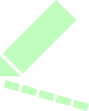
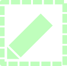
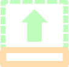
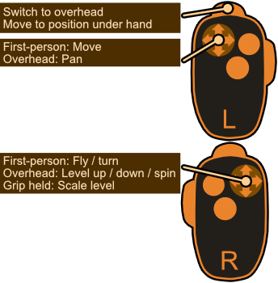

### [Try the editor right now at Github Pages](https://donitzo.github.io/wad-together/)

## Project Overview

WAD Together is an experimental Doom map editor that runs entirely in your web browser. It includes a 2D editing view, a real-time 3D preview, and support for most popular Doom ports.

It also introduces several new ideas, such as real-time multiplayer editing, smart topology completion, and VR/XR rendering.


### Multiplayer Editing

The editor was designed with collaborative editing in mind, using a GUID-less networking layer to synchronize maps between any number of clients.

The networking model is authoritative and room-based. A single server can host any number of rooms. Each room has one administrator and any number of regular users. ny changes a user makes to the map are validated by the administrator and mirrored to all other clients.

A feature we worked hard on was personalized undo histories. Each user in a room can undo or redo their own actions without interfering with those of other users. While this may seem like overkill, undo is an important feature in any decent workflow. This was made possible by the GUID-less design, which allows actions to be stored in a primitive form (for example, create a line from P1 to P2 or assign texture T to the line P1:P2). Additionally, sectors are derived entirely from line data and computed locally rather than synchronized over the network.


### Smart Topology

Another idea we had in mind when designing the editor was that creating geometry should be fast and completely reliable. At no point should the map contain broken geometry (aside from stray lines). Line intersections are handled automatically and sector generation is implicit. One interesting consequence of this approach is that every enclosed region becomes a valid sector. To distinguish regions that should not exist in the exported map, we introduced a special `Is Void` property that marks sectors to be ignored during export.

The topology system was built from scratch using first principles. Admittedly, it would probably have been faster to study how existing editors solve the problem, but building it ourselves proved to be an  educational experience.

### Known Limitations

The editor has several important limitations that users should keep in mind. Doom has a large ecosystem of games, source ports, and storage formats, which makes testing and supporting everything quite a challenge:

* There is no built-in node builder. Exported maps are not playable in legacy ports until nodes have been built using another editor, such as Ultimate Doom Builder. Maps should work without additional processing in GZDoom and Eternity Engine.
* Floating-point coordinates are not supported. Any UDMF floating-point coordinates are rounded to the nearest integer during import.
* Custom properties and the `BEHAVIOR`, `SCRIPTS`, and `DIALOGUE` lumps are not preserved when importing maps. Other mod-specific data will also be lost.
* Source port detection is not flawless. Verify the target port in `Map Metadata` before working on a map, since this will affect which properties are enabled.
* PK3 import support is still flawed. WAD files are currently recommended.
* Maps are not stored on the server. They exist only while being shared between connected clients. If the room administrator disconnects, all users are disconnected and any unsaved changes are lost.

If you encounter a compatibility issue, or if there is a port or format you would like to see supported, please [open an issue](https://github.com/Donitzo/wad-together/issues) using the `compatibility` label.

## Quick Start

To get started, you can either host your own Node.js server or use the [online editor](https://donitzo.github.io/wad-together/). Note that multiplayer requires the full Node.js server. The GitHub Pages version hosts only the static editor and does not support multiplayer.

### Installation

Clone the repository:

```bash
git clone https://github.com/donitzo/wad-together.git
```

Install the required Node.js modules:

```bash
cd wad-together
npm install
```

Before starting the server, you may want to adjust some of the configuration constants in `server.js`. By default, the server listens on all network interfaces using port `8080`, or the port specified by the `PORT` environment variable.

Start the server:

```bash
npm start
```

### Doom Launcher Configuration

To launch maps directly from the editor, use the included `doom_launcher.js` script.

Open `doom_launcher.js` and configure the following constants:

* `DOOM_EXECUTABLE_PATH` - Path to your GZDoom executable.
* `RESOURCE_DIRECTORIES` - A list of directories containing your WADs.

Then start the launcher:

```bash
npm run doom_launcher
```

The launcher runs in the background, listening for connections on `localhost`. Press the `Play` button in the editor to send the current map to the launcher. The map is saved in the `./maps` directory and launched using your configured source port.

Close the launcher when you are finished.

## Using the Editor

The editor should feel familiar to anyone with experience using Doom, Duke3D, or Blender.

On the left side of the screen is the sidebar, which contains the following tabs:

* **WAD**  - Load the WAD files required for the map you are working on. For example, when editing a Doom II map, load your own `doom2.wad`. You can also load saved map WADs. Note the `Map Name` the map was saved under, as this is the name you must select from the dropdown when importing it.


* **Users**  - In online rooms, this tab displays all connected users. Click `PM` to send a private message. Room administrators can also kick, ban, and manage user permissions.
* **Inspector**  - A context-sensitive property editor. It displays the relevant properties for the current selection, or the map metadata when nothing is selected. **Tip:** Number fields support click-and-drag scrubbing.
* **Textures**  - Browser for the currently loaded wall textures.
* **Flats**  - Browser for the currently loaded floor and ceiling textures.
* **Things**  - Browser for the currently loaded Things, along with the built-in defaults.
* **Sounds**  - Lists all sound effects found in the currently loaded WAD files.

**Note:** Property visibility and the export format (Binary WAD or UDMF TextMap) are determined by the selected source port in **Map Metadata**. Try switching between ports to see which properties are available.


### Navigation

Press `Tab` to switch between the 2D and 3D viewports.

The editor was designed for a keyboard+mouse-driven workflow, with your left hand resting on `WASD` and your right hand controlling the mouse. `WASD` allows you to move around in both the 2D and 3D views.

In the 2D view, hold the right mouse button to pan quickly. In the 3D view, hold the right mouse button to fly around. Hold `Shift` while moving to strafe.

#### Editing Modes

There are six editing modes: selection , line drawing , rectangle drawing , ellipse drawing , extrusion , and Thing placement . You can switch between modes using the buttons in the editor or their corresponding keyboard shortcuts.

Press `Space` at any time to return to selection mode and click again deselect everything.

**Note:** You can view all available shortcuts by clicking the  button in the editor.


#### Multiplayer

To create a multiplayer room, connect to the server with `?online` appended to the URL. A new room will be created with you as its administrator.

You can then share the URL with its generated token, with other users. Anyone who opens the URL will join your room directly.

You can chat with other users using the chat box at the bottom of the screen.

**Note:** Any map you have loaded will be shared with users who join the room, but your loaded WAD files will not. Users who have not loaded their own WAD files will see only the default textures.

#### Virtual Reality

When the editor is opened on a WebXR-capable device, two additional buttons,  and , become available. These allow you to view the map in virtual or augmented reality.

Use the trigger to switch between overhead and first-person modes. In overhead mode, use the controller sticks to move the level. In first-person mode, use the sticks to walk around the map.



## Development and Feedback

The editor is still under development, and compatibility testing is ongoing.

| Target / Source Port | Status                                                    |
| -------------------- | --------------------------------------------------------- |
| Vanilla Doom         | Requires nodes to be built using an external node builder |
| Vanilla Hexen        | Requires nodes to be built using an external node builder |
| GZDoom               | Tested and working                                        |
| Eternity Engine      | Not yet tested; feedback is welcome                       |
| Chocolate Doom       | Not yet tested; feedback is welcome                       |
| Crispy Doom          | Not yet tested; feedback is welcome                       |

If you encounter a compatibility issue, please [open an issue](https://github.com/Donitzo/wad-together/issues) with the `compatibility` label. You may also submit a pull request to update the compatibility table.

For general bug reports, [open an issue](https://github.com/Donitzo/wad-together/issues) with the `bug` label. For feature requests, use the `feature-request` label.

## License

The editor and its dependencies include software and assets distributed under the following licenses:

* This editor is licensed under the [MIT License](https://github.com/Donitzo/wad-together/blob/main/LICENSE).
* [Three.js](https://github.com/mrdoob/three.js/blob/dev/LICENSE) is licensed under the MIT License.
* [Socket.IO](https://github.com/socketio/socket.io/blob/main/LICENSE) is licensed under the MIT License.
* [JSZip](https://github.com/Stuk/jszip/blob/main/LICENSE.markdown) is licensed under the MIT License.
* The player sprite and Miniwad demo WAD are taken from the Freedoom project and distributed under its [BSD license](https://github.com/freedoom/freedoom/blob/master/COPYING.adoc).
* The PixelOperator font is licensed under the [CC0 1.0 Universal public-domain dedication](https://creativecommons.org/publicdomain/zero/1.0/deed.en).
